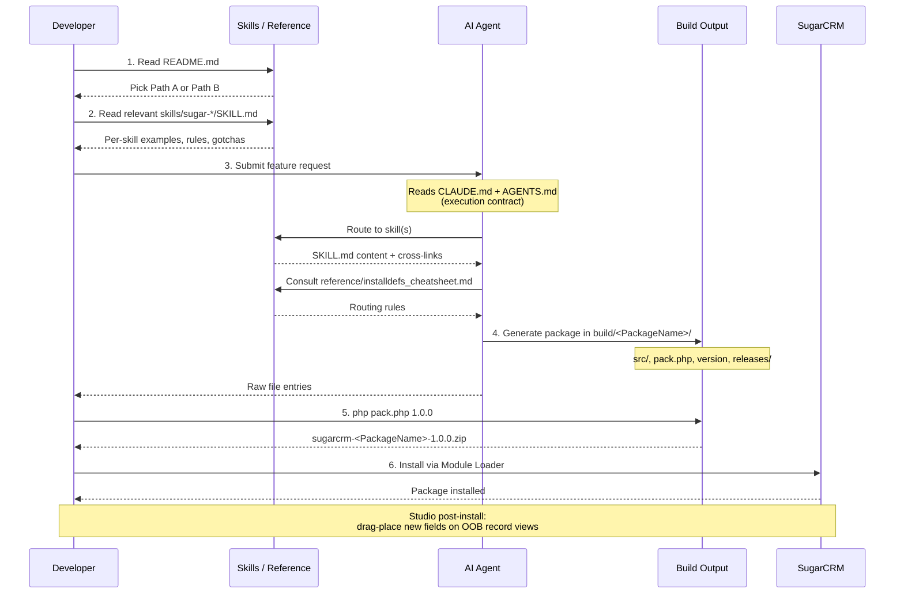

# AI for Sugar Devs

**AI for Sugar Devs** is a Sugar developer skills library for generating installable, upgrade-safe SugarCRM Module Loadable Packages (MLPs) — from a single logic hook up to a full multi-module package with relationships, sidecar layouts, icons, and language registration.

Designed for **Sugar developers** with any AI agent (Claude Code, Copilot, ChatGPT, Codex). Skills are exposed as `SKILL.md` files with YAML frontmatter so Claude Code can route them automatically, while remaining plain-markdown-friendly for everything else.

---

## Choose your path

This repo supports two scales of work. Pick the one that matches your task:

### Path A — Single-feature MLP

You want to add ONE specific thing to an existing Sugar instance — a logic hook, a custom field, one relationship, a REST endpoint, a scheduler, or a UI tweak.

1. Format your request using **[prompts/feature_request_format.md](prompts/feature_request_format.md)**
2. Pick the matching skill from `skills/`:
   - **[sugar-logic-hook](skills/sugar-logic-hook/SKILL.md)** — react to bean events
   - **[sugar-custom-field](skills/sugar-custom-field/SKILL.md)** — vardef custom field (`_c` suffix)
   - **[sugar-custom-field-type](skills/sugar-custom-field-type/SKILL.md)** — highlight, color picker, etc.
   - **[sugar-rest-endpoint](skills/sugar-rest-endpoint/SKILL.md)** — custom REST routes
   - **[sugar-scheduler](skills/sugar-scheduler/SKILL.md)** — cron jobs
   - **[sugar-ui-customization](skills/sugar-ui-customization/SKILL.md)** — Sidecar views/dashlets/subpanels
   - **[sugar-external-resource-client](skills/sugar-external-resource-client/SKILL.md)** — outbound HTTP
3. Build the zip: `cd build/<PackageName> && php pack.php 1.0.0`
4. Install via **Admin → Module Loader**

Examples: `examples/01_logic_hook_webhook.md`, `examples/02_custom_field_varchar.md`, `examples/03_relationship_many_to_many.md`, `examples/04_rest_endpoint_api.md`, `examples/06_notes_1m_attachment.md`.

### Path B — Full module package (MB-style)

You want to scaffold a brand-new module, or multiple modules linked together — the kind of package Module Builder would produce, but generated by AI and aware of every gotcha.

1. Read **[skills/sugar-feature-generator/SKILL.md](skills/sugar-feature-generator/SKILL.md)** — the orchestrator
2. Read **[skills/sugar-new-module/SKILL.md](skills/sugar-new-module/SKILL.md)** — Escalation singular/plural pattern, ~22 files per module
3. Read **[skills/sugar-relationship/SKILL.md](skills/sugar-relationship/SKILL.md)** — MB-style M:M-with-join-table even for 1:M
4. Read **[skills/sugar-notes-attachment/SKILL.md](skills/sugar-notes-attachment/SKILL.md)** — the Notes exception (parent_id/parent_type)
5. Read **[skills/sugar-module-icons/SKILL.md](skills/sugar-module-icons/SKILL.md)** — `installdefs['image_dir']` (NOT `$manifest`)
6. Read **[skills/sugar-application-language/SKILL.md](skills/sugar-application-language/SKILL.md)** — sidebar + dropdowns
7. Read **[skills/sugar-package-build/SKILL.md](skills/sugar-package-build/SKILL.md)** — pack.php with all 7 installdefs sections
8. Use **[templates/full_module/](templates/full_module/)** as your starting scaffold
9. Use **[templates/relationship/](templates/relationship/)** for each relationship

Or — if you already have a Module Builder export zip — start at **[skills/sugar-mb-export-flow/SKILL.md](skills/sugar-mb-export-flow/SKILL.md)** to strip the doubled prefix and apply the singular-bean-class override.

Example: `examples/05_full_module_package.md`.

---

## Complete workflow



---

## Repository layout

```
├── README.md                 ← human entry point (you are here)
├── CLAUDE.md                 ← entry point for Claude Code (skill routing)
├── AGENTS.md                 ← binding execution contract (v2 mandates)
├── skills/                   ← 19 SKILL.md files
│   ├── sugar-logic-hook/
│   ├── sugar-custom-field/
│   ├── sugar-custom-field-type/
│   ├── sugar-relationship/
│   ├── sugar-rest-endpoint/
│   ├── sugar-scheduler/
│   ├── sugar-ui-customization/
│   ├── sugar-external-resource-client/
│   ├── sugar-feature-generator/    (orchestrator)
│   ├── sugar-package-build/        (pack.php)
│   ├── sugar-mlp-anatomy/          (7 installdefs sections)
│   ├── sugar-new-module/           (MB-style full module)
│   ├── sugar-notes-attachment/     (Notes 1:M exception)
│   ├── sugar-mb-export-flow/       (turn MB export into MLP)
│   ├── sugar-module-icons/         (image_dir gotcha)
│   ├── sugar-application-language/ (sidebar + dropdowns)
│   ├── sugar-address-grouping/     (Quotes fieldset pattern)
│   ├── sugar-studio-debugging/     (symptom → fix table)
│   └── sugar-viewdef-editing/      (safe Sidecar viewdef edits)
├── prompts/
│   ├── feature_request_format.md   ← canonical input schema
│   └── *.md                        ← compat shims (redirect to skills/)
├── reference/
│   ├── master_reference.md
│   ├── installdefs_cheatsheet.md   ← 7 sections + file routing
│   ├── module_anatomy.md           ← file-by-file new-module walkthrough
│   ├── common_gotchas.md           ← symptom → root cause table
│   └── sugar_developer_guide_25.2_md/
├── templates/
│   ├── minimal_mlp/
│   │   ├── pack.stub.php           ← 7-section scanner (full)
│   │   └── pack.simple.stub.php    ← single-section copy (simple)
│   ├── full_module/                ← parameterized ~22-file module scaffold
│   └── relationship/               ← 5-file relationship template
└── examples/
    ├── 01_logic_hook_webhook.md
    ├── 02_custom_field_varchar.md
    ├── 03_relationship_many_to_many.md
    ├── 04_rest_endpoint_api.md
    ├── 05_full_module_package.md   ← multi-module walkthrough
    └── 06_notes_1m_attachment.md   ← minimal Notes 1:M example
```

---

## Conventions enforced everywhere

The full list lives in **[AGENTS.md](AGENTS.md)** under "Recent Mandates (v2)". The most-frequently-violated ones:

1. Custom field names MUST end in `_c`
2. Vardefs use `vname`, never `label`
3. NO `'help'` text on vardefs — labels carry it
4. `image_dir` belongs in `$installdefs`, NEVER `$manifest`
5. Escalation pattern: module folder/table PLURAL; bean class/object_name/$dictionary key SINGULAR
6. Relationships: lhs = parent, rhs = child
7. M:M-with-join-table even for declared 1:M (MB convention) — except Notes
8. Notes 1:M: parent_id/parent_type with `relationship_role_column`
9. `$app_list_strings` for moduleList + dropdowns MUST be application-scope
10. HTTP from PHP uses `Sugarcrm\Sugarcrm\Security\HttpClient\ExternalResourceClient` only — never curl/file_get_contents/fopen/stream_get_contents
11. After install: new fields on OOB modules need Studio drag-place

---

## For AI agents

- **[CLAUDE.md](CLAUDE.md)** — Claude Code skill routing entry point
- **[AGENTS.md](AGENTS.md)** — binding execution contract (mandatory rules, prohibited actions, code quality)
- **[skills/sugar-feature-generator/SKILL.md](skills/sugar-feature-generator/SKILL.md)** — orchestrator skill

For any AI agent (Claude, Copilot, ChatGPT, Codex), the routing table in CLAUDE.md plus the YAML frontmatter on each `SKILL.md` should be enough to find the right skill from a developer intent phrase.

---

## Submitting a feature request (Path A example)

```text
Read and follow AGENTS.md strictly.
Read and follow skills/sugar-feature-generator/SKILL.md strictly.
No explanations. No markdown. Output raw file entries only.

Feature Type: Logic Hook
Module: Accounts
Trigger: after_save
Condition:
  field: account_type = 'Customer' or
  field: account_type = 'Prospect'
Action:
  type: webhook
  method: POST
  url: https://webhooks.com/mywebhook
  payload: full bean
  extract the response if http 200 log the result and return 'myresponse'
Package Name: Custom_AccountsCustomerWebhook
```

Then:

```bash
cd build/Custom_AccountsCustomerWebhook
php pack.php 1.0.0
# → releases/sugarcrm-Custom_AccountsCustomerWebhook-1.0.0.zip
```

Install via **Admin → Module Loader**.

For full multi-module work (Path B), see `examples/05_full_module_package.md`.

---

## Why this matters

AI can generate Sugar code, but without structure it produces inconsistent and unsafe packages. This system enforces:

- **Extension Framework purity** — no core overrides
- **Upgrade safety by contract** — install/uninstall via Module Loader
- **Deterministic builds** — reproducible, testable packages
- **Sidecar-aware** — knows about viewdefs, sidecar layouts, application-scope language
- **MB-style fluency** — produces packages that look like Module Builder output (and works around MB's quirks: doubled prefix, label-vs-vname, image_dir misplacement)

It transforms AI from a code assistant into a controlled, production-ready Sugar MLP compiler.
